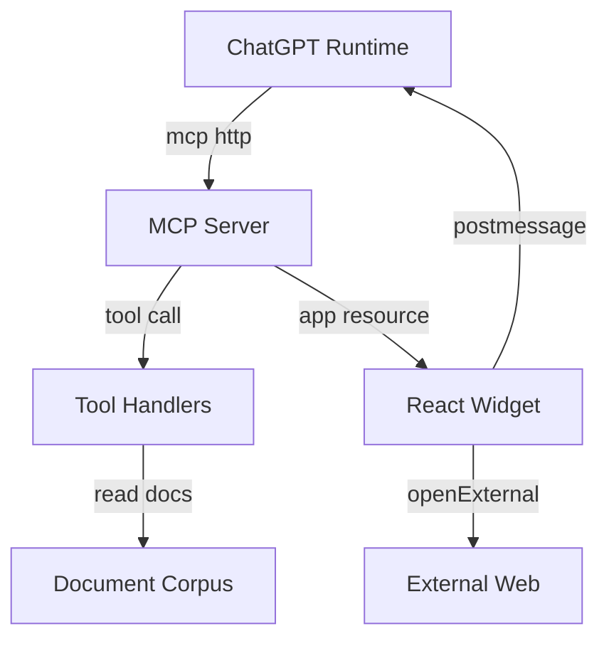

## Executive summary
The highest risks are unauthorized or cross-tenant exposure of confidential document data through an internet-exposed `/mcp` endpoint that has no repo-local authentication checks, plus abuse opportunities at two trust boundaries: permissive CORS on the MCP transport and permissive `postMessage` usage in the widget bridge. Availability risk is also meaningful because each MCP request constructs a new app server and reloads local resources, which can be amplified under production traffic.

## Scope and assumptions
- In scope:
  - `server/src/index.ts` (HTTP listener, MCP transport, tool handlers, CORS behavior)
  - `web/src/component.tsx` (widget bridge, tool invocation, external URL open flow)
  - `data/documents.json` (knowledge corpus format and URL source)
  - `README.md` (deployment guidance, internet exposure via ngrok)
- Out of scope:
  - ChatGPT platform internals and identity controls not implemented in this repo
  - Reverse proxies, WAFs, API gateways, or network ACLs not represented in repo code
  - Dependency supply-chain and CI pipeline hardening (no `.github` workflows present in repo)
- Explicit assumptions (user-validated):
  - Service handles both development and production traffic.
  - Data is confidential and tenant-specific.
  - Primary auth boundary is ChatGPT-only access control, not repo-local auth code.
  - `/mcp` may be internet reachable in production-like use (evidence: ngrok setup in `README.md`).
- Open questions that could materially change ranking:
  - Is there an external gateway enforcing mTLS, signed requests, or IP allowlists in front of `/mcp`?
  - Is tenant isolation expected within a single server instance, or by separate deployment per tenant?

## System model
### Primary components
- Node HTTP MCP server (`createServer`, `MCP_PATH="/mcp"`) in `server/src/index.ts`.
- MCP tool layer (`search`, `fetch`, `render_search_widget`) registered on `McpServer`.
- Local document store loaded from `data/documents.json` and indexed in memory (`documentsById`).
- Widget resource served by app tool and rendered by React component in `web/src/component.tsx`.
- ChatGPT parent runtime bridge via JSON-RPC `postMessage` and `tools/call`.
- Dev/build tooling (`esbuild`, `tsc`, `tsx`) from `package.json` and `tsconfig.json` is non-runtime.

### Data flows and trust boundaries
- ChatGPT runtime -> MCP server `/mcp`
  - Data: tool names, tool arguments (`query`, `id`), returned document content/metadata.
  - Channel: HTTP streamable MCP transport.
  - Security guarantees: none enforced in repo code beyond method/path routing; CORS is wildcard (`Access-Control-Allow-Origin: *`).
  - Validation: Zod input schemas enforce only basic shape (`z.string().min(1)` for tool args).
- MCP tools -> in-memory corpus
  - Data: document IDs, titles, URLs, full text, metadata.
  - Channel: in-process memory access from `documentsById`.
  - Security guarantees: no tenant scoping or authorization checks in `fetch` path.
  - Validation: corpus schema validated at load with `documentSchema` including `url()` and `metadata` type.
- MCP server -> widget resource
  - Data: HTML shell, JS bundle, `structuredContent` search results, `_meta.selectedDocument`.
  - Channel: MCP app resource/tool response.
  - Security guarantees: CSP metadata with empty connect/resource domain lists in resource `_meta.ui.csp`.
  - Validation: none on textual tool output beyond JSON generation.
- Widget -> ChatGPT parent (`postMessage`)
  - Data: JSON-RPC requests/responses, `ui/message`, `tools/call` requests.
  - Channel: browser `postMessage`.
  - Security guarantees: checks `event.source === window.parent`, but no origin allowlist check.
  - Validation: minimal shape checks (`jsonrpc`, `id`, `method`).
- Widget -> external URL open
  - Data: selected document URL.
  - Channel: `window.openai.openExternal`.
  - Security guarantees: none in widget for host/protocol allowlist.
  - Validation: URL previously accepted by server-side `z.string().url()` when corpus loaded.

#### Diagram

## Assets and security objectives
| Asset | Why it matters | Security objective (C/I/A) |
|---|---|---|
| Tenant document text and metadata | Confidential tenant data exposure can cause contractual/compliance impact | C |
| Document IDs and retrieval mapping | Predictable retrieval can enable unauthorized record access at scale | C/I |
| Tool output integrity (`search`, `fetch`, widget `_meta`) | Tampered output can mislead users and downstream AI decisions | I |
| ChatGPT-only trust boundary assumptions | If boundary is bypassed, repo has no fallback auth checks | C/I |
| Service availability at `/mcp` | Production traffic and repeated session creation can degrade responsiveness | A |
| Widget-to-parent message channel | Bridge misuse can trigger unintended tool calls or deceptive UI state | I |
| Outbound URL launch behavior | Malicious URLs can cause phishing or unsafe navigation | C/I |

## Attacker model
### Capabilities
- Remote attacker can send HTTP requests to `/mcp` if endpoint is publicly reachable.
- Browser-based attacker can attempt cross-origin calls due to permissive CORS.
- Attacker controlling or poisoning corpus content can influence `url` and displayed text fields.
- Attacker can generate high request volume to stress per-request server setup and file reads.
- Attacker may attempt to spoof widget message traffic where origin validation is weak.

### Non-capabilities
- No assumed direct shell access to host/container.
- No assumed ability to modify repository source at runtime.
- No assumed break of ChatGPT platform internals or TLS itself.
- No assumed database injection path (no database client in repo runtime).

## Entry points and attack surfaces
| Surface | How reached | Trust boundary | Notes | Evidence (repo path / symbol) |
|---|---|---|---|---|
| `GET/POST/DELETE /mcp` | Internet/ChatGPT HTTP requests | External caller -> MCP server | Primary tool entrypoint; wildcard CORS and no repo-local auth gate | `server/src/index.ts` (`MCP_PATH`, lines around CORS headers and route branch) |
| `OPTIONS /mcp` preflight | Browser cross-origin preflight | Browser origin -> MCP server | Explicitly allows `*` origin and MCP session header | `server/src/index.ts` (`Access-Control-Allow-Origin`, `Allow-Headers`) |
| `GET /` health endpoint | Internet HTTP request | External caller -> server metadata | Exposes app identity/version; low sensitivity but confirms liveness | `server/src/index.ts` (`req.method === "GET" && url.pathname === "/"`) |
| MCP `search` tool input | MCP tool call argument `{query}` | Tool caller -> search logic | Read-only but can be abused for corpus enumeration | `server/src/index.ts` (`registerTool("search")`) |
| MCP `fetch` tool input | MCP tool call argument `{id}` | Tool caller -> direct document lookup | No tenant/authz check before returning full document | `server/src/index.ts` (`registerTool("fetch")`, `documentsById.get(id)`) |
| `render_search_widget` tool | MCP app tool call | Tool caller -> widget payload generator | Returns selected document in `_meta` and result set | `server/src/index.ts` (`registerAppTool("render_search_widget")`) |
| Widget `postMessage` RPC | Parent frame messaging | Parent runtime -> widget | Accepts parent source but no explicit origin verification | `web/src/component.tsx` (`window.addEventListener("message")`) |
| Widget external link open | User UI action | Widget -> external web | Opens URL derived from document data | `web/src/component.tsx` (`openExternal({ href })`) |

## Top abuse paths
1. Goal: Exfiltrate confidential tenant content.
   - Steps: Discover public `/mcp` -> call `search` to enumerate IDs -> call `fetch` for each ID -> collect full text and metadata.
   - Impact: Bulk unauthorized disclosure of tenant data.
2. Goal: Abuse browser context to invoke MCP actions cross-origin.
   - Steps: Host malicious webpage -> issue cross-origin requests to `/mcp` -> leverage permissive CORS and exposed session header -> scrape responses.
   - Impact: Stealthy data extraction without direct shell/network foothold.
3. Goal: Trigger cross-tenant data mixing.
   - Steps: Query generic terms -> receive global result list -> fetch by ID with no tenant context binding.
   - Impact: One tenant can access another tenant's records if corpus is shared.
4. Goal: Manipulate widget behavior via message spoofing/confused deputy.
   - Steps: Send crafted JSON-RPC messages to iframe parent chain -> widget accepts source parent without origin checks -> update payload/tool flow.
   - Impact: Integrity loss in displayed results and potential unsafe user actions.
5. Goal: Phishing or unsafe navigation via corpus URL poisoning.
   - Steps: Insert malicious but syntactically valid URL into document corpus -> user clicks Open source -> external site opened.
   - Impact: User credential theft or malware exposure outside app boundary.
6. Goal: Degrade availability under production traffic.
   - Steps: Flood `/mcp` with requests -> force repeated `createAppServer()`, file reads, server/transport setup -> resource exhaustion.
   - Impact: Latency spikes, failures, and possible outage.
7. Goal: Recon for targeted abuse.
   - Steps: Probe `GET /` and error responses -> identify app/version/paths -> tune attack timing and request shape.
   - Impact: Improves attacker efficiency; lower direct impact.

## Threat model table
| Threat ID | Threat source | Prerequisites | Threat action | Impact | Impacted assets | Existing controls (evidence) | Gaps | Recommended mitigations | Detection ideas | Likelihood | Impact severity | Priority |
|---|---|---|---|---|---|---|---|---|---|---|---|---|
| TM-001 | Remote internet attacker | `/mcp` reachable and no upstream auth gate beyond assumed ChatGPT-only control | Enumerate via `search`, then exfiltrate full docs via `fetch` | Confidential tenant data disclosure | Tenant docs, metadata, trust boundary assumptions | Tool schemas require non-empty strings; `fetch` checks ID exists (`server/src/index.ts`) | No repo-local authn/authz or tenant binding in tool handlers | Enforce signed caller identity at gateway; require per-request auth token verification in server; add tenant context to tool args and enforce row-level checks before returning data | Alert on anomalous `fetch` volume per caller/tenant; track unique ID fetch bursts | High | High | critical |
| TM-002 | Browser-based attacker on malicious origin | Victim browser can reach `/mcp`; CORS wildcard remains enabled | Use cross-origin fetch/preflight against `/mcp` and extract responses | Unauthorized data access and boundary bypass | Tenant docs, service boundary integrity | CORS and headers explicitly configured (`Access-Control-Allow-Origin: *`) | Origin not restricted; no CSRF-like anti-replay or audience check | Restrict CORS to trusted ChatGPT origins; verify origin/audience headers; require bearer auth independent of CORS | Log origin header, user-agent, and preflight/request mismatches; alert on unknown origins | Medium | High | high |
| TM-003 | Authenticated but unauthorized tenant user or compromised integration client | Shared corpus or mixed-tenant dataset in single deployment | Fetch documents outside caller tenant scope by ID | Cross-tenant confidentiality breach | Tenant docs, data isolation integrity | Corpus schema validation only (`documentSchema`) | No tenant ID in schema, index, or tool contracts; no authz policy layer | Add `tenantId` to schema and index; include tenant in tool inputs from trusted identity context; enforce allow checks before search/fetch response | Emit audit logs with caller tenant and doc tenant; alert on mismatches | Medium | High | high |
| TM-004 | Malicious content publisher or compromised data pipeline | Attacker can insert/alter `url` field in corpus source | Supply harmful external URL and induce user to click Open source | Phishing/malware risk and trust erosion | User trust, outbound navigation integrity | URL syntax validation via Zod (`z.string().url()`) | No domain/protocol allowlist; no warning interstitial | Enforce https-only and allowlisted domains for source URLs; show destination domain confirmation in UI; sanitize or strip non-http(s) schemes | Log opened domains and blocklist hits; monitor spikes in new domains | Medium | Medium | medium |
| TM-005 | Remote DoS attacker | Network access to `/mcp` endpoint | Send high-rate requests to force repeated app/server creation and file reads | Service slowdown or outage | Availability of `/mcp` | Basic path/method routing and error handling (`server/src/index.ts`) | No rate limiting, caching reuse, or admission control | Reuse singleton app server and cached corpus/bundle; add per-IP or per-client rate limits at edge; add circuit breaker/timeouts | Track request rate, p95 latency, in-flight requests, and error rates; alert on saturation | High | Medium | high |
| TM-006 | Malicious parent context or compromised embedding environment | Widget receives parent messages; no explicit origin pinning | Send crafted JSON-RPC messages to influence widget state or tool calls | Integrity compromise of UI state and potential unsafe actions | Tool output integrity, user trust | `event.source === window.parent` check exists (`web/src/component.tsx`) | Missing `event.origin` validation and strict message schema checks | Validate `event.origin` against trusted list; enforce strict JSON-RPC schema and method allowlist; reject unsolicited tool-result events | Client telemetry for rejected messages and unexpected methods | Medium | Medium | medium |
| TM-007 | Opportunistic recon attacker | Service is internet visible | Probe health and error responses to fingerprint app and tune attacks | Better targeting efficiency | Service metadata, attack surface secrecy | Minimal root JSON and generic 404/500 responses (`server/src/index.ts`) | Health endpoint reveals app name/version/path; no throttling for probing | Reduce version detail in public health response; separate internal health route; add request throttling | Monitor endpoint probing patterns and unusual method mixes | Medium | Low | low |

## Criticality calibration
- critical:
  - Unauthorized bulk exfiltration of confidential tenant documents from `/mcp` (`TM-001`).
  - Proven cross-tenant read path where tenant A can access tenant B corpus entries (`TM-003` when confirmed in deployment).
- high:
  - CORS/origin misconfiguration enabling non-ChatGPT caller access to production data (`TM-002`).
  - Availability degradation that materially disrupts production tool usage under realistic traffic or abuse (`TM-005`).
- medium:
  - Widget bridge integrity issues requiring compromised embedding context or message spoof path (`TM-006`).
  - Malicious outbound source links causing phishing risk without direct data-plane compromise (`TM-004`).
- low:
  - Informational service fingerprinting from health endpoint/version disclosure (`TM-007`).
  - Minor noisy abuse that does not cross tenant/data boundaries and is quickly mitigated operationally.

## Focus paths for security review
| Path | Why it matters | Related Threat IDs |
|---|---|---|
| `server/src/index.ts` | Core trust boundary code for HTTP exposure, CORS, tool authz gaps, and per-request server lifecycle | TM-001, TM-002, TM-003, TM-005, TM-007 |
| `web/src/component.tsx` | Widget bridge and outbound navigation logic determine client-side integrity and social-engineering exposure | TM-004, TM-006 |
| `data/documents.json` | Data shape and URL values drive exfiltration impact and outbound link trust | TM-001, TM-003, TM-004 |
| `README.md` | Deployment guidance defines intended internet exposure and operational assumptions | TM-001, TM-002, TM-005 |
| `package.json` | Runtime and build dependencies affect attack surface and hardening opportunities | TM-005, TM-006 |

## Notes on use
- This model is repository-grounded and intentionally separates runtime threats from build/dev concerns; the highest priorities assume production exposure and tenant-sensitive data.
- If an external gateway enforces strong caller authentication, strict origin policy, and tenant identity propagation, TM-001 and TM-002 likelihood should be recalibrated downward.
- Major evidence anchors:
  - `server/src/index.ts`: wildcard CORS headers, `/mcp` route handling, `registerTool("fetch")`, `createAppServer()` per request.
  - `web/src/component.tsx`: `postMessage("*")`, message handler without origin pinning, `openExternal`.
  - `README.md`: public ngrok exposure guidance.
  - `data/documents.json`: sample corpus containing retrievable URLs and text payloads.
- Quality check:
  - All discovered entry points covered: yes.
  - Each trust boundary represented in threats: yes.
  - Runtime vs CI/dev separation: yes.
  - User clarifications reflected: yes (dev+prod, tenant-sensitive data, ChatGPT-only control).
  - Assumptions and open questions explicit: yes.

## Post-hardening control mapping (2026-03-14)
| Threat ID | Implemented controls in repo | Status |
|---|---|---|
| TM-001 | Optional bearer auth gate (`AUTH_BEARER_TOKEN`), OAuth-style challenge mode, and stricter origin controls on `/mcp` in `server/src/index.ts` | mitigated (partial) |
| TM-002 | CORS allowlist enforcement with ChatGPT origin defaults and explicit deny for untrusted origins (`server/src/security.ts`, `server/src/index.ts`) | mitigated |
| TM-003 | Tenant header parsing and tenant-scoped filtering of search/fetch/render results (`TENANT_ID_HEADER`, `REQUIRE_TENANT_ID`) in `server/src/index.ts` | mitigated (depends on `metadata.tenantId` quality) |
| TM-004 | URL safety enforcement with host/protocol policy in server and `https` plus allowed-host checks before `openExternal` in widget (`server/src/security.ts`, `web/src/component.tsx`) | mitigated |
| TM-005 | In-memory sliding-window rate limiter for `/mcp` (`RATE_LIMIT_WINDOW_MS`, `RATE_LIMIT_MAX_REQUESTS`) in `server/src/index.ts` | mitigated (single-instance only) |
| TM-006 | Trusted parent-origin checks plus strict payload parsing on bridge messages in `web/src/component.tsx` | mitigated |
| TM-007 | No dedicated hardening change; residual low-risk recon exposure remains on health endpoint | accepted residual risk |
