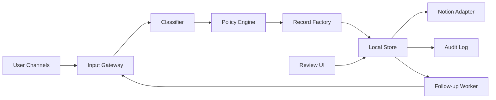

# Greenfield Autonomous Work OS Implementation Plan

อัปเดตล่าสุด: 2026-03-30

## วัตถุประสงค์

เอกสารนี้เป็น implementation doc และ rollout plan สำหรับเริ่มโปรเจกต์ใหม่แบบ clean-slate โดย:

- ไม่ยึดฐานข้อมูล Notion เดิม
- ยึดฟังก์ชันการทำงานของระบบเดิมเป็น requirement หลัก
- รวมคำแนะนำเชิงพัฒนาที่เสนอไว้ก่อนหน้านี้เข้าเป็นแผนเดียว
- ออกแบบให้พร้อมต่อยอดเป็นระบบ autonomous ที่คุยกับ AI แล้วสร้างงาน, research, knowledge, incident, และ follow-up ได้เอง

เอกสารนี้ตั้งใจให้ใช้เป็น master blueprint สำหรับเปิดโปรเจกต์ใหม่ตั้งแต่วันแรก

## 1. สิ่งที่ต้องคงไว้จากระบบเดิม

ฟังก์ชันเหล่านี้ถือเป็น contract หลักที่โปรเจกต์ใหม่ต้องรักษาไว้:

| Function | พฤติกรรมที่ต้องคงไว้ |
| --- | --- |
| Conversation capture | รับข้อความจากผู้ใช้แล้วบันทึกเป็น structured record ได้ |
| Intent classification | แยกได้อย่างน้อย `task`, `todo`, `research`, `knowledge`, `incident`, `inbox` |
| Due/review extraction | ดึง due date, review date, urgency, และ owner จากข้อความได้ |
| Policy routing | รองรับ `ask-first`, `hybrid`, `auto` |
| Status lifecycle | อัปเดตสถานะ `draft`, `active`, `done`, `blocked`, `archived` ได้ |
| Duplicate control | มี idempotency และ duplicate detection |
| Follow-up jobs | สร้าง reminder หรือ review queue ให้ record ที่ถึงเวลาได้ |
| Auditability | ทุก write action ต้องมี activity log |
| Provider neutrality | สลับ OpenAI / Claude ได้ โดย business rules ไม่แตก |
| Downstream sync | local write สำเร็จก่อน แล้วค่อย sync ลง Notion หรือ storage ปลายทาง |
| Human override | ผู้ใช้สามารถ review, approve, edit, และแก้ route ได้ |

## 2. สิ่งที่เปลี่ยนใหม่ทั้งหมด

เพื่อไม่ผูกกับของเดิม โปรเจกต์ใหม่ควรออกแบบใหม่ใน 5 มิติ:

1. ชื่อ databases และ pages ใหม่ทั้งหมด
2. schema ใหม่ทั้งหมด โดยออกแบบจาก domain ใหม่ ไม่ใช่ copy ของเดิม
3. routing vocabulary ใหม่ให้สอดคล้องกับทีม/งานจริง
4. project structure ใหม่ที่รองรับ AI-native workflow ตั้งแต่ต้น
5. bootstrap docs ใหม่ที่ย้ายข้ามโปรเจกต์ได้โดยไม่อ้าง data source IDs เก่า

## 3. หลักการออกแบบ

- Notion หรือ primary database เป็น source of truth
- AI เป็น decision layer และ orchestration layer ไม่ใช่ data owner
- ทุก automation ต้องแยก `local success` ออกจาก `sync success`
- schema ต้องออกแบบจาก `signal -> decision -> action`
- เริ่มด้วย human-in-the-loop แล้วค่อยขยายไป hybrid และ autonomous
- ทุก record ต้อง trace กลับไปยัง source conversation หรือ source event ได้
- ทุกสิ่งที่ reusable ต้องมีทาง promote ไป knowledge hub
- fallback path ต้องมีตั้งแต่วันแรก โดยไม่รอ incident จริง

## 4. เป้าหมายของโปรเจกต์ใหม่

ระบบใหม่ควรทำได้ครบในระดับ production-ready:

1. ผู้ใช้คุยกับ AI เรื่องงาน แล้วระบบสร้าง task/todo ได้เอง
2. ถ้าเป็นคำถามหรือเรื่องที่ต้องหาข้อมูลต่อ ระบบสร้าง research record ได้
3. ถ้าเป็น insight, decision, runbook, lesson learned ระบบเก็บเข้า knowledge hub ได้
4. ถ้าเป็นปัญหา/ความผิดพลาด ระบบเปิด incident record และ follow-up task ได้
5. ถ้าข้อความกำกวม ระบบเข้า conversation inbox เพื่อ triage ได้
6. ระบบติดตาม due date, review date, stale work, blocked work ได้เอง
7. ระบบ sync ลง Notion ได้อัตโนมัติ แต่ไม่ทำให้ local state เสียถ้า downstream ล้ม
8. มี UI สำหรับ review, approve, override, และติดตาม metrics

## 5. เป้าหมายเชิงเอกสารและ artifact

โปรเจกต์ใหม่ควรมี artifact หลักตั้งแต่เริ่ม:

| Artifact | ประเภท | บทบาท |
| --- | --- | --- |
| `01 Strategy Home` | Page | objective เดียว, scope, outcomes |
| `02 Implementation Plan` | Page | phase plan, deliverables, acceptance criteria |
| `03 System Runbook` | Page | schema contracts, fallback path, setup sequence |
| `04 Mission Control` | Page | entry point สำหรับ operator และ reviewers |
| `05 Incident Playbook` | Page | incident flow, rollback rules, request logging |
| `06 Metrics and Governance` | Page | KPIs, review cadence, audit criteria |

## 6. Greenfield Notion Information Model

### 6.1 Recommended database stack

สำหรับโปรเจกต์ใหม่ แนะนำฐานข้อมูลหลัก 6 ตัว และ optional 1 ตัว:

| Database | บังคับ/ทางเลือก | บทบาท |
| --- | --- | --- |
| `Conversation Inbox` | บังคับ | เก็บข้อความที่ยังไม่ควร auto-write ทันที |
| `Work Items` | บังคับ | เก็บ `task` และ `todo` ทั้งหมด |
| `Research Library` | บังคับ | เก็บ research requests, hypotheses, findings |
| `Knowledge Hub` | บังคับ | เก็บ decisions, runbooks, recaps, documentation |
| `Incident Register` | บังคับ | เก็บ issues, incident lifecycle, workaround, root cause |
| `AI Run Log` | บังคับ | เก็บทุก automation run, provider, latency, errors |
| `Projects` | ทางเลือก | ใช้เมื่อมีหลาย project หรือหลาย workstreams |

### 6.2 Database schema ที่แนะนำ

#### `Conversation Inbox`

| Property | Type | หน้าที่ |
| --- | --- | --- |
| `Title` | Title | ชื่อสั้นของ capture |
| `Original Message` | Rich text | ข้อความต้นฉบับ |
| `Suggested Type` | Select | `task`, `todo`, `research`, `knowledge`, `incident`, `inbox` |
| `Confidence` | Number | score จาก classifier |
| `Policy Mode` | Select | `ask-first`, `hybrid`, `auto` |
| `Status` | Status | `new`, `reviewing`, `resolved`, `dismissed` |
| `Source Channel` | Select | chat/web/slack/line/api |
| `Conversation ID` | Text | trace กลับ |
| `Message ID` | Text | idempotency trace |
| `Created At` | Created time | audit |

#### `Work Items`

| Property | Type | หน้าที่ |
| --- | --- | --- |
| `Title` | Title | ชื่องาน |
| `Work Type` | Select | `task`, `todo` |
| `Status` | Status | `draft`, `active`, `done`, `blocked`, `archived` |
| `Priority` | Select | `low`, `medium`, `high`, `urgent` |
| `Assignee` | People | เจ้าของงาน |
| `Due Date` | Date | วันครบกำหนด |
| `Review Date` | Date | follow-up date |
| `Project` | Relation | optional relation ไป Projects |
| `Workflow` | Select | execution workflow |
| `Domain` | Select | business domain |
| `Source Excerpt` | Rich text | ข้อความต้นทาง |
| `Source Conversation ID` | Text | trace กลับ |
| `Source URL` | URL | ลิงก์ต้นทางถ้ามี |
| `Tags` | Multi-select | routing/filters |
| `AI Confidence` | Number | model confidence |
| `Duplicate Fingerprint` | Text | dedupe key |

#### `Research Library`

| Property | Type | หน้าที่ |
| --- | --- | --- |
| `Title` | Title | หัวข้อ research |
| `Question` | Rich text | คำถามหลัก |
| `Status` | Status | `draft`, `active`, `done`, `archived` |
| `Priority` | Select | ลำดับความสำคัญ |
| `Owner` | People | ผู้รับผิดชอบ |
| `Due Date` | Date | วันครบกำหนด |
| `Review Date` | Date | review cadence |
| `Hypothesis` | Rich text | สมมติฐาน |
| `Findings Summary` | Rich text | บทสรุป |
| `Next Action` | Rich text | ขั้นต่อไป |
| `Source Excerpt` | Rich text | แหล่งที่มาจาก chat |
| `Source URL` | URL | ลิงก์ต้นทาง |
| `Promote To Knowledge` | Checkbox | พร้อม promote หรือยัง |
| `Tags` | Multi-select | filters |

#### `Knowledge Hub`

| Property | Type | หน้าที่ |
| --- | --- | --- |
| `Title` | Title | ชื่อ knowledge record |
| `Record Type` | Select | `decision`, `documentation`, `runbook`, `faq`, `recap` |
| `Status` | Status | `draft`, `active`, `done`, `archived` |
| `Knowledge Domain` | Select | domain กลาง |
| `Owner` | People | reviewer/owner |
| `Review Date` | Date | next revision |
| `Summary` | Rich text | บทสรุป |
| `Outcome` | Rich text | conclusion/result |
| `Next Action` | Rich text | next step ถ้ามี |
| `Source Record URL` | URL | ลิงก์ record ต้นทาง |
| `Source Conversation ID` | Text | trace กลับ |
| `Tags` | Multi-select | indexing |
| `Decision Quality` | Select | `confirmed`, `provisional`, `hypothesis` |

#### `Incident Register`

| Property | Type | หน้าที่ |
| --- | --- | --- |
| `Title` | Title | ชื่อ incident |
| `Severity` | Select | `low`, `medium`, `high`, `critical` |
| `Status` | Status | `new`, `active`, `mitigated`, `resolved`, `archived` |
| `Owner` | People | incident owner |
| `Detected At` | Date | เวลาพบ |
| `Impact Summary` | Rich text | ผลกระทบ |
| `Root Cause` | Rich text | สาเหตุ |
| `Workaround` | Rich text | ทางแก้ชั่วคราว |
| `Permanent Fix` | Rich text | ทางแก้ถาวร |
| `Follow-up Due` | Date | review date |
| `Related Work Item URL` | URL | ลิงก์ task/fix |
| `Source Excerpt` | Rich text | ข้อความต้นทาง |

#### `AI Run Log`

| Property | Type | หน้าที่ |
| --- | --- | --- |
| `Run Name` | Title | ชื่อ run |
| `Trigger Type` | Select | `capture`, `status-update`, `follow-up`, `promotion`, `manual-review` |
| `Provider` | Select | `heuristic`, `openai`, `anthropic` |
| `Model` | Text | รุ่น model |
| `Status` | Status | `started`, `completed`, `failed` |
| `Input Fingerprint` | Text | dedupe trace |
| `Records Created` | Number | metric |
| `Records Updated` | Number | metric |
| `Latency Ms` | Number | metric |
| `Error Summary` | Rich text | incident/debug |
| `Started At` | Date | timing |
| `Finished At` | Date | timing |

### 6.3 Governance views ที่ต้องมี

ทุกโปรเจกต์ใหม่ควรสร้าง views ขั้นต่ำ:

- `Inbox Triage`
- `Tasks by Status`
- `Overdue Work`
- `Research Awaiting Review`
- `Knowledge Review Queue`
- `Active Incidents`
- `AI Runs Failed`
- `Missing Required Fields`

## 7. Routing Vocabulary ใหม่ที่แนะนำ

เพื่อไม่ผูกกับ taxonomy เก่า แนะนำคำกลางที่ใช้ข้ามทุก record:

### 7.1 Work types

- `task`
- `todo`
- `research`
- `knowledge`
- `incident`
- `inbox`

### 7.2 Workflows

- `capture`
- `execution`
- `research`
- `knowledge-promotion`
- `incident-response`
- `governance`

### 7.3 Domains

เริ่มจาก 5 domain ทั่วไปก่อน:

- `product`
- `operations`
- `growth`
- `finance`
- `platform`

แล้วค่อยแตกเพิ่มตามโปรเจกต์จริง

## 8. Runtime Architecture ที่แนะนำ



### 8.1 Components ที่ต้องมี

| Component | บทบาท |
| --- | --- |
| Input Gateway | รับ event จาก chat/API/app |
| Classifier | ตีความข้อความและสกัด structured fields |
| Policy Engine | ตัดสินใจว่าจะ auto-save หรือส่งเข้า review |
| Record Factory | สร้าง normalized record ตาม type |
| Local Store | source of truth ระยะใกล้ |
| Notion Adapter | sync ลง Notion แบบ downstream |
| Follow-up Worker | สร้าง reminders, stale checks, review tasks |
| Review UI | ให้คน approve/edit/reject |
| Audit Log | เก็บทุก run และทุก state change |

### 8.2 API contract ที่ควรรักษาไว้

อย่างน้อยควรมี:

- `POST /automation/capture`
- `GET /automation/records`
- `POST /automation/records/status`
- `POST /automation/followups/run`
- `GET /automation/state`

และ MCP tools ที่เทียบกัน:

- `capture_conversation`
- `list_automation_records`
- `update_automation_record_status`
- `run_follow_up_cycle`

## 9. โครงสร้างโค้ดที่แนะนำสำหรับโปรเจกต์ใหม่

```text
server/
  src/
    domain/
      automation-types.ts
      classification.ts
      policy.ts
      followups.ts
      dedupe.ts
    providers/
      openai.ts
      anthropic.ts
    adapters/
      local-store.ts
      notion/
        notion-sync.ts
        notion-mapper.ts
        notion-schema.ts
    services/
      capture-service.ts
      status-service.ts
      promotion-service.ts
      review-service.ts
    transport/
      http.ts
      mcp.ts
      scheduler.ts
    index.ts
web/
  src/
    automation-review/
    automation-dashboard/
docs/
  implementation-plan.md
  system-runbook.md
  notion-schema.md
```

### 9.1 สิ่งที่นำกลับมาใช้ได้จาก repo ปัจจุบัน

logic ที่ควร reuse โดยแนวคิด:

- classifier baseline จาก [server/src/automation-engine.ts](server/src/automation-engine.ts)
- store semantics จาก [server/src/automation-store.ts](server/src/automation-store.ts)
- downstream sync model จาก [server/src/notion-sync.ts](server/src/notion-sync.ts)
- MCP/HTTP integration model จาก [server/src/index.ts](server/src/index.ts)

แต่ให้เปลี่ยน schema, mapping, และ bootstrap ทั้งหมดเป็นของโปรเจกต์ใหม่

## 10. Recommendation Pack ที่ต้องรวมเข้าไปตั้งแต่ต้น

คำแนะนำก่อนหน้าทั้งหมดควรถูกรวมเข้า target scope ของโปรเจกต์ใหม่:

1. provider abstraction สำหรับ OpenAI และ Claude
2. intent schema และ routing policy กลาง
3. write tools สำหรับ capture/create/update
4. Notion adapter layer แยกจาก MCP/UI layer
5. background worker สำหรับ follow-up jobs
6. audit log และ idempotency key ทุก write action
7. review UI สำหรับ human override
8. template package สำหรับ strategic summary, implementation plan, runbook, incident, and review pages
9. field mapping matrix ระหว่าง domain ใหม่กับ governance fields
10. validation checklist ก่อน promote เข้า knowledge hub
11. standard fallback pattern สำหรับกรณี Notion write path หรือ linked database embedding มีปัญหา
12. metrics dashboard สำหรับ precision, duplicate rate, sync health, review backlog

## 11. Delivery Plan

### Phase 0: Project Foundation

เป้าหมาย:

- ชัดเจนว่า objective เดียวของโปรเจกต์คืออะไร
- สรุป actors, scope, channels, และ record types
- ตั้ง naming standard และ routing vocabulary กลาง

deliverables:

- `01 Strategy Home`
- `02 Implementation Plan`
- `03 System Runbook`
- routing vocabulary v1

acceptance criteria:

- ทุกคนตอบได้ว่าระบบนี้สร้างมาเพื่ออะไร
- รู้ว่า record types มีอะไรและใช้เมื่อไร
- รู้ว่า source of truth อยู่ที่ไหน

### Phase 1: Greenfield Data Model

เป้าหมาย:

- สร้าง databases ใหม่ทั้งหมด
- ไม่ reuse IDs, names, หรือ assumptions จาก workspace เดิม
- มี views สำหรับ execution และ governance ตั้งแต่ต้น

deliverables:

- `Conversation Inbox`
- `Work Items`
- `Research Library`
- `Knowledge Hub`
- `Incident Register`
- `AI Run Log`
- governance views

acceptance criteria:

- สร้าง record ตัวอย่างครบทุก type ได้
- query/filter ได้ตาม role จริง
- ไม่มี field บังคับที่ยังไม่ถูกกำหนด contract

### Phase 2: Runtime Core

เป้าหมาย:

- รับข้อความแล้วสร้าง local records ได้
- มี status lifecycle, dedupe, idempotency, follow-up scheduling

deliverables:

- schemas และ domain services
- local store
- HTTP endpoints
- MCP write tools

acceptance criteria:

- capture task/todo/research/knowledge/incident/inbox ได้
- update status ได้
- follow-up cycle สร้าง reminders ได้
- duplicate replay ไม่สร้าง record ซ้ำ

### Phase 3: Provider Layer

เป้าหมาย:

- รองรับ OpenAI และ Claude
- ถ้า provider ล้ม ต้อง fallback ได้

deliverables:

- `providers/openai.ts`
- `providers/anthropic.ts`
- prompt contract และ JSON schema
- provider-neutral classification interface

acceptance criteria:

- เปลี่ยน provider โดยไม่แตะ business rules
- fallback heuristic ยังทำงานได้เมื่อไม่มี API key
- มี contract test สำหรับ output schema

### Phase 4: Review and Approval Surface

เป้าหมาย:

- ผู้ใช้ review/approve/edit/reject captures ได้
- ระบบรองรับ `ask-first` และ `hybrid`

deliverables:

- review dashboard
- inbox triage flow
- approve/edit/reject actions

acceptance criteria:

- ambiguous captures ไป `Conversation Inbox`
- reviewer แก้ type/status/priority ก่อน commit ได้
- มี audit trail ทุกการ approve/reject

### Phase 5: Notion Sync and Promotion

เป้าหมาย:

- sync local records ลง Notion ใหม่ทั้งหมด
- promote research/knowledge ไป `Knowledge Hub`

deliverables:

- Notion mapper ใหม่
- sync status in API responses
- promotion rules

acceptance criteria:

- local success ไม่พังแม้ sync fail
- record ที่ sync สำเร็จมี external metadata กลับมา
- knowledge promotion มี validation checklist ก่อนส่งเข้า hub

### Phase 6: Autonomous Operations

เป้าหมาย:

- ระบบติดตามงานเองได้
- สร้าง reminder, stale work alerts, และ review queue ได้

deliverables:

- scheduler
- blocked/stale detectors
- auto follow-up generation
- optional auto status suggestion

acceptance criteria:

- overdue tasks ถูก detect ได้
- research ที่ถึง review date ถูก re-queue ได้
- incident follow-up ถูกตั้งอัตโนมัติได้

### Phase 7: Governance and Reuse Pack

เป้าหมาย:

- ระบบพร้อมใช้กับโปรเจกต์ถัดไป
- มี bootstrap pack และ docs ครบ

deliverables:

- schema templates
- env template
- fallback playbook
- metrics dashboard
- onboarding checklist

acceptance criteria:

- เปิดโปรเจกต์ใหม่ได้โดยไม่ต้อง reverse engineer workspace เก่า
- มี import/setup docs ครบ
- มี weekly governance cadence และ metrics dashboard ใช้งานจริง

## 12. Suggested Mode Policy

เริ่มต้นแนะนำแบบนี้:

| Record Type | Phase 1 | Phase 2 | Phase 3 |
| --- | --- | --- | --- |
| `task` | ask-first | hybrid | auto เมื่อ confidence สูง |
| `todo` | ask-first | hybrid | auto |
| `research` | ask-first | ask-first | hybrid |
| `knowledge` | ask-first | ask-first | hybrid หลังมี reviewer |
| `incident` | hybrid | hybrid | hybrid หรือ auto-create + human review |
| `inbox` | auto-route | auto-route | auto-route |

กฎเริ่มต้นที่แนะนำ:

- task/todo auto-create เฉพาะเมื่อ confidence >= 0.85
- research/knowledge ต้องมี human review ก่อนอย่างน้อยในช่วงแรก
- incident ถ้าคำบ่งชี้รุนแรงให้ auto-open record แต่ต้องมี owner review

## 13. Metrics ที่ต้องวัด

metrics หลัก:

- auto-capture precision
- duplicate rate
- follow-up completion rate
- sync success rate
- median chat-to-record latency
- % records with complete routing fields
- % inbox items resolved within SLA
- knowledge promotion precision
- incident response lead time

## 14. Initial Backlog สำหรับ Sprint แรก

1. เขียน Strategy Home และกำหนด objective เดียว
2. เขียน Implementation Plan พร้อม acceptance criteria
3. สร้าง System Runbook และ naming standard
4. สร้าง 6 databases ใหม่ทั้งหมด
5. สร้าง views สำหรับ triage, execution, governance
6. ย้าย automation schemas ออกจาก monolith เป็น domain modules
7. เพิ่ม provider abstraction
8. เพิ่ม local store + idempotency + audit log
9. เพิ่ม HTTP endpoints + MCP tools
10. เพิ่ม Notion sync adapter ใหม่แบบไม่อิง IDs เก่า
11. เพิ่ม review dashboard
12. เพิ่ม scheduler และ follow-up worker

## 15. Launch Checklist

- มี Notion workspace ใหม่หรือ section ใหม่สำหรับโปรเจกต์นี้
- สร้าง pages และ databases ตาม blueprint แล้ว
- กำหนด required properties ครบทุกฐานข้อมูล
- ตั้งค่า provider keys และ env ครบ
- ทดสอบ capture ทุก record type อย่างน้อย 1 ตัวอย่าง
- ทดสอบ sync failure โดยไม่ให้ local state พัง
- ทดสอบ duplicate replay
- ทดสอบ follow-up cycle
- เปิด governance views และ review queue
- เขียน incident fallback path แล้ว

## 16. ข้อสรุปเชิงปฏิบัติ

ถ้าจะเริ่มโปรเจกต์ใหม่แบบเร็วแต่ไม่มั่ว:

1. อย่าเริ่มจาก sync หรือ UI
2. เริ่มจาก objective, schema, และ policy ก่อน
3. สร้าง databases ใหม่ทั้งหมดให้ตรง domain ใหม่
4. reuse เฉพาะฟังก์ชันและ runtime pattern จากของเดิม
5. แยก local source of truth ออกจาก downstream Notion sync ตั้งแต่แรก
6. เปิด `ask-first` ก่อน แล้วค่อยไต่ไป `hybrid` และ `auto`
7. สร้าง bootstrap pack สำหรับโปรเจกต์ถัดไปทันทีเมื่อ phase แรกเสร็จ

## 17. Related References

- [Notion System Handoff and Reuse Guide](docs/notion-system-handoff.md)
- [Notion Live Sync Setup](docs/notion-live-sync-setup.md)
- [automation-engine.ts](server/src/automation-engine.ts)
- [notion-sync.ts](server/src/notion-sync.ts)
- [index.ts](server/src/index.ts)
