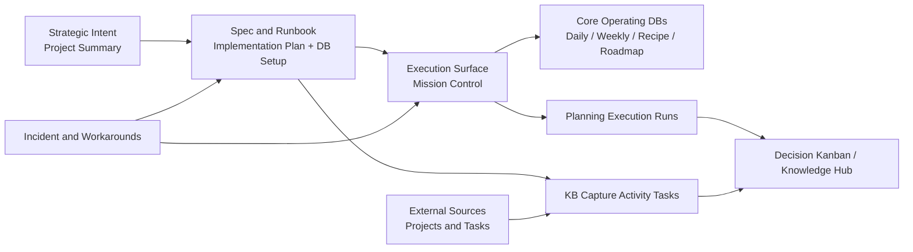
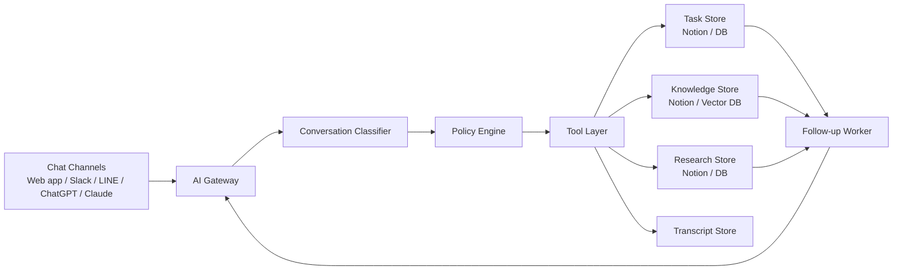

# Notion System Handoff and Reuse Guide

อัปเดตล่าสุด: 2026-03-30

## วัตถุประสงค์

เอกสารนี้สรุประบบงานที่ถูกสร้างและใช้งานบน Notion จนถึงปัจจุบัน โดยจัดให้อยู่ในรูปแบบที่หยิบไปใช้ต่อในโปรเจกต์อื่นได้ง่ายขึ้น แกนของเอกสารนี้คือ:

- สรุปฟังก์ชันการทำงานที่มีอยู่จริง
- แยกผู้เกี่ยวข้อง (parties / actors) และหน้าที่
- รวบรวมเงื่อนไขการทำงาน กติกา และข้อจำกัด
- สรุปกระบวนการพัฒนาและลำดับการตัดสินใจตามเวลา
- แปลงทั้งหมดให้เป็น blueprint สำหรับ reuse

หมายเหตุ:

- ข้อมูลทั้งหมดในเอกสารนี้สังเคราะห์จากหน้า Notion และ schema ของฐานข้อมูลที่เกี่ยวข้อง
- ข้อความที่เป็นการตีความเพื่อเชื่อมภาพรวมจะระบุว่า "Inference"

## 1. Executive Summary

ระบบ Notion ปัจจุบันไม่ได้เป็นแค่พื้นที่จดบันทึก แต่ทำหน้าที่เป็น operating system แบบครบวงจรสำหรับ 4 ชั้นงานพร้อมกัน:

1. Strategic alignment: กำหนด objective เดียว, pillar หลัก, และผลลัพธ์ที่ต้องการ
2. Operational execution: ใช้ Mission Control เป็นหน้าควบคุมประจำวันเพื่อวิ่ง daily loop และ weekly loop
3. Knowledge and governance: เก็บ run log, promote ความรู้ที่ใช้ซ้ำได้, และควบคุม taxonomy/routing ผ่านฐานข้อมูลกลาง
4. Integration and rollout: รองรับ MCP-first workflow, เชื่อม external sources, และมี runbook/incident handling สำหรับงานพัฒนา

สภาพปัจจุบันถือว่า baseline ทำงานได้แล้ว โดย phase foundation, core databases, และ dashboard enablement ถูกระบุว่า complete ภายในวันที่ 2026-03-14 และมีการต่อยอดไปสู่ agent-integrated workflow, bilingual standard, external source integration, และ reusable bootstrap guidance ในวันที่ 2026-03-14 ถึง 2026-03-15

## 2. System Architecture Overview

### 2.1 ชั้นของระบบ

| Layer | หน้าที่ | องค์ประกอบหลัก |
| --- | --- | --- |
| Strategic layer | กำหนด objective, pillars, expected outcomes, canonical structure | Project Summary and Knowledge Base Synthesis |
| Spec and runbook layer | กำหนด schema, field contract, setup rules, migration-safe standards | Implementation Plan, 12 - Notion Database Setup, bootstrap profile |
| Execution layer | ใช้ทำงานจริงรายวันและรายสัปดาห์ | Mission Control (Live), core operating databases |
| Logging and promotion layer | เก็บ run log, promote knowledge, เชื่อม run ไป canonical records | Planning Execution Runs, Decision Kanban |
| Operational delivery layer | จัดการ implementation/research/spec update/governance tasks | Knowledge Base Capture Activity Tasks |
| Integration layer | ดึงข้อมูลจาก external sources และ map เข้า taxonomy เดียวกัน | Projects and Tasks Source Integration, external Projects and Tasks source |
| Reliability layer | จัดการ incident, workaround, และ safe write path | Incident Report and follow-up pages |

### 2.2 แผนภาพการไหลของงาน



## 3. Functional Modules

### 3.1 ฟังก์ชันหลักของระบบ

| Function | สิ่งที่ระบบทำ | Inputs หลัก | Outputs / ผลลัพธ์ |
| --- | --- | --- | --- |
| Strategic alignment | กำหนด objective เดียว, pillars, expected outcomes, และ canonical home structure | เป้าหมายระดับระบบ, operating principles | หน้าอ้างอิงกลางสำหรับการตัดสินใจทุก workflow |
| Mission Control | เป็น cockpit สำหรับ plan -> do -> review รายวัน | priorities, daily checklist, live DB links | daily execution flow, evening reset, entry point เดียว |
| Daily tracking | เก็บ signal ระดับวัน เช่น sleep, exercise, protein, deep work, mood, focus | ตัวเลขและ reflection รายวัน | ข้อมูลต้นน้ำสำหรับ weekly review |
| Weekly review | สรุปสัญญาณรายสัปดาห์ให้กลายเป็น decisions | aggregate metrics, what worked, bottlenecks | add/remove decisions, next week actions |
| Food lab management | จัดการ recipe tests, scoring, repeatability, pairing ideas | dish testing data | recipe backlog, status progression, learnings |
| Roadmap tracking | ติดตาม milestone, priority, deadline, next action | strategic milestones | long-term progression และ execution queue |
| Planning and execution logging | log ทุก conversation/run และเก็บ structured execution payload | run intent, assumptions, milestones, top actions, review date | run records, status updates, promotion metadata |
| Knowledge promotion | promote run ที่ reusable ไปยัง canonical knowledge hub | promoted run records | decision, documentation, recapture, runbook records |
| Task execution governance | แยก operational tasks ออกจาก product/life databases และบังคับ routing metadata | implementation/research/spec/governance tasks | task board, cycle time, missing routing audit |
| External source integration | register และ map source databases ภายนอกเข้ามาใน taxonomy กลาง | source page, schema access, data-source IDs | integrated source records และ sync-ready mapping |
| Reliability and incident handling | เก็บ incident, reproduction steps, request IDs, workaround path | failed MCP writes, validation errors | stable workaround, canonical incident page |
| Documentation standardization | บังคับ TH/EN structure และ minimum sections | new task pages, integration records | สื่อสารได้สม่ำเสมอและ reuse ได้ง่าย |

### 3.2 ฐานข้อมูลและหน้าหลักที่ต้องรู้

| Artifact | ประเภท | บทบาท |
| --- | --- | --- |
| Project Summary and Knowledge Base Synthesis | Page | strategic intent และ canonical synthesis model |
| Implementation Plan - The Upgrade Protocol Import Pack | Page | แผนโครงการ, requirement, acceptance criteria, rollout phases |
| 12 - Notion Database Setup | Page | schema declaration, setup rules, field contract, agent-stack DB references |
| 01 - Mission Control (Live) | Page | daily operational cockpit สำหรับใช้งานจริง |
| 01 - Mission Control (Fallback) | Page | fallback reference เมื่อ linked view หรือ live flow ใช้ไม่ได้ |
| Daily Tracker | Database | เก็บ signal รายวัน |
| Weekly Reviews | Database | แปลงสัญญาณเป็น decisions รายสัปดาห์ |
| Recipe Cards | Database | food-lab experimentation |
| Restaurant Roadmap | Database | long-term execution and milestones |
| Planning Execution Runs | Database | log ทุก run ของ planning/execution workflow |
| Decision Kanban | Database | canonical hub ของ knowledge records และ promoted outputs |
| Knowledge Base Capture Activity Tasks | Database | operational task delivery และ governance |
| Projects and Tasks | External source page with 2 databases | source ภายนอกที่ถูกเชื่อมผ่าน MCP |

## 4. Parties / Actors ที่เกี่ยวข้อง

### 4.1 คนและบทบาทโดยตรง

| Party | บทบาท | ความรับผิดชอบ |
| --- | --- | --- |
| Nut Rattanasaksopana | Owner, workspace operator, assignee หลัก | เป็นเจ้าของระบบ, execute tasks, review outcomes, เป็น default owner ของงานใหม่ |
| End user / daily operator | ผู้ใช้ Mission Control ในชีวิตประจำวัน | เปิดใช้เช้า-เย็น, กรอกข้อมูลจริง, ปิด daily loop, ทำ weekly review |

Inference:

- จากข้อมูลปัจจุบัน owner และ end user คือคนเดียวกัน แต่โครงสร้างนี้สามารถแยก role ได้ถ้านำไปใช้กับทีมอื่น

### 4.2 ระบบและตัวกลางเชิงเทคนิค

| Party | บทบาท | ความรับผิดชอบ |
| --- | --- | --- |
| Notion MCP server | Integration layer | อ่าน/เขียนข้อมูล, fetch schema, create/update pages, query data sources |
| Planning and Execution AI Agent | Planning copilot | รับ input แบบ discussion-first, สร้าง structured output contract, ส่ง payload เข้า Notion |
| Decision Kanban / Knowledge Hub | Canonical knowledge destination | เก็บเอกสาร, decision, runbook, recapture ที่นำกลับมาใช้ซ้ำได้ |
| KB Capture Activity Tasks | Delivery governance layer | track implementation, research, incident, spec update, governance tasks |
| External source owners / template sources | Upstream source providers | เป็นต้นทางของ schema/template ที่ถูก import หรือ map เข้าระบบ |

### 4.3 Parties ที่เกี่ยวข้องตาม phase งาน

| Phase | Party หลัก | สิ่งที่ต้องรับผิดชอบ |
| --- | --- | --- |
| Foundation | Owner + Notion MCP | สร้าง spec, setup DBs, ยืนยัน hierarchy |
| Execution | Operator + Mission Control | ใช้งาน daily and weekly loop จริง |
| Knowledge promotion | Agent + Knowledge Hub | log run, promote knowledge, back-link records |
| Governance | Owner + Task DB | audit routing fields, review cadence, cycle time |
| Reliability | Owner + MCP integration layer | capture incident, reproduce, hold workaround until upstream fix |

## 5. Working Conditions, Rules, and Constraints

### 5.1 Operating principles

จากหน้า strategic summary และ implementation plan ระบบนี้ทำงานภายใต้หลักการต่อไปนี้:

- Real usage first: ทุกอย่างต้องใช้ได้จริง ไม่ใช่แค่สวยหรือครบเชิงโครงสร้าง
- Signals -> decisions: field หรือ metrics ที่เก็บต้องนำไปตัดสินใจได้
- One objective: ทุกหน้า support objective เดียว ไม่ให้ระบบแตกกระจาย
- Consistency > intensity: เน้นทำให้ loop ติดก่อน แล้วค่อยเพิ่มความเข้ม
- Notion as single source of clarity: Notion เป็นศูนย์กลางของความชัดเจนและการทำงาน

### 5.2 Functional conditions

- ทุกอย่างต้องอยู่ภายใต้ project เดียว
- ต้องมี 4 core databases เป็นอย่างน้อย: Daily Tracker, Weekly Reviews, Recipe Cards, Restaurant Roadmap
- Home/Mission Control ต้องเป็น entry point ที่ใช้งานจริง
- daily tracking ต้องกรอกได้เร็ว
- weekly review ต้องแปลงเป็น decisions ได้จริง
- recipe workflow ต้องมี score และ next iteration
- roadmap ต้องมี status และ next milestone action

### 5.3 Data and schema rules

- ห้ามเพิ่ม field ใหม่ถ้า field นั้นไม่ช่วย weekly decisions
- schema page เป็น contract/reference เท่านั้น การเปลี่ยน property จริงต้องทำที่ database
- ทุก run ต้องถูก log ใน Planning Execution Runs
- ถ้า run ไหน reusable ต้อง promote ไป hub และ back-link ด้วย `Hub Record URL`
- task ใหม่ใน KB task database ต้องมี routing fields อย่างน้อย:
  - `Task`
  - `Status`
  - `Priority`
  - `Activity Type`
  - `Scope`
  - `Workflow`
  - `Source Page URL`

### 5.4 Governance rules

- มี weekly audit เพื่อตรวจว่าไม่มีแถวไหนขาด `Activity Type`, `Scope`, หรือ `Workflow`
- มีมุมมอง `Missing Routing Fields (Governance)` และ `Needs Routing Fix` สำหรับบังคับความครบถ้วน
- มีการติดตาม cycle time และ governance cadence แยกจากงาน product/life operation

### 5.5 Language and formatting rules

- หน้า operational สำคัญต้องใช้มาตรฐานสองภาษา TH/EN
- heading และ key bullet ควรมีทั้งภาษาไทยและภาษาอังกฤษ
- หนึ่งบรรทัดควรมีหนึ่งความหมาย
- task pages อย่างน้อยต้องมี:
  - Objective
  - Execution checklist
  - Done criteria

### 5.6 Integration and safety constraints

- MCP-first เป็น default path สำหรับ setup และ sync
- ต้องทดสอบแบบไม่ทำลาย workspace
- หาก follow-up incident ต้องมี request ID ใหม่ทุกครั้ง
- เมื่อการ insert linked database ผ่าน markdown ใช้ไม่ได้ ให้ fallback เป็น links-first และ explicit MCP page/database operations

## 6. Current Data Model Summary

### 6.1 Core operating databases

| Database | จุดประสงค์ | ฟิลด์สำคัญ |
| --- | --- | --- |
| Daily Tracker | เก็บ operational signals รายวัน | Date, Sleep Hours, Exercise Minutes, Total Protein, Deep Work 1/2, Learning Minutes, Mood, Focus, Daily Score, Wins Today, Improve Tomorrow |
| Weekly Reviews | แปลง data รายวันเป็น decisions รายสัปดาห์ | Avg Sleep, Exercise Minutes, Deep Work Blocks, Focus Max, What Worked, Main Bottleneck, Add Next Week, Remove Next Week |
| Recipe Cards | จัดการการทดลองอาหารและการ iterate | Dish Name, Cuisine Style, Estimated Protein, Taste Score, Presentation Score, Repeatability, Status |
| Restaurant Roadmap | ติดตาม milestone ระยะยาว | Milestone, Category, Priority, Status, Deadline, Notes |

### 6.2 Agent stack databases

| Database | จุดประสงค์ | ฟิลด์สำคัญ |
| --- | --- | --- |
| Planning Execution Runs | เก็บ run-level telemetry และ sync payload | Name, Run Date, PARA Type, PARA Target, Outcome, Do-Now Actions, Status, Promoted to Hub, Hub Record URL, Capture Type |
| Decision Kanban | เก็บ canonical knowledge records ที่ promote แล้ว | Title, Activity Type, Decision Quality, Knowledge Domain, Owner, Scope, Workflow, Review Date, Target Record URL |
| Knowledge Base Capture Activity Tasks | จัดการงานดำเนินการและ governance | Task, Assignee, Phase, Priority, Status, Activity Type, Workflow, Source Page URL, Risk Pattern |

### 6.3 External source integration

Projects and Tasks source ถูกยืนยันว่าเข้าถึงผ่าน MCP ได้แล้ว ณ วันที่ 2026-03-15 โดยพบ 2 data sources:

- Projects = `collection://<REDACTED>`
- Tasks = `collection://<REDACTED>`

การ map ที่ประกาศไว้คือ:

- Project fields -> project execution metadata
- Task fields + project relation -> task execution linkage

## 7. Development Timeline to Date

### 2026-03-14: Baseline system completed

- สร้าง implementation plan สำหรับ The Upgrade Protocol Import Pack
- ยืนยัน architecture ว่า pages เป็น documentation/spec layer และ databases เป็น operational layer
- phase foundation, core database buildout, และ dashboard enablement ถูกระบุว่า complete
- 4 core databases และ Mission Control/Home ถูกประกาศว่าใช้งานจริงได้แล้ว

### 2026-03-14: Canonical setup and runbook layer established

- สร้าง/ยืนยันหน้า `12 - Notion Database Setup` ให้เป็น schema declaration กลาง
- ขยาย runbook ให้รองรับ agent-stack databases ได้แก่ Planning Execution Runs และ Decision Hub
- ระบุ operational rule ว่าทุก conversation/run ต้องถูก log และ reusable records ต้องถูก promote

### 2026-03-14: Mission Control execution surface stabilized

- มีทั้ง `Mission Control (Live)` และ `Mission Control (Fallback)`
- live page ใช้เป็น cockpit หลักสำหรับเช้า-เย็น
- fallback page ใช้เป็น structured reference เมื่อ linked/live experience ใช้งานไม่ได้ตามคาด

### 2026-03-14: Reliability incident discovered and standardized

- พบว่า inline linked database insertion ผ่าน markdown `data-source-url` ใช้งานไม่ได้
- error ที่ยืนยันซ้ำได้คือ `Data source not found: {{collection://...}}`
- มีการเก็บ request IDs, reproduction steps, impact, และ workaround ชัดเจน
- workaround ปัจจุบันคือ links-first และ explicit MCP page/database operations

### 2026-03-14: Bootstrap guidance became versioned and executable

- มีงาน `UP-013 Write Notion bootstrap profile`
- มีงาน `UP-014 Add MCP bootstrap command examples`
- ผลลัพธ์คือ bootstrap guidance ถูก versioned และ setup sequence กลายเป็น executable path โดยไม่ต้องตัดสินใจเพิ่มหน้างาน

### 2026-03-15: Knowledge and operations model expanded

- สร้าง `Project - Mission Control System` เป็น canonical project record สำหรับ dashboard wiring และ execution loops
- สร้าง `Research Summary - Planning + Execution AI Agent Design with Notion Integration`
- ขยายจาก source baseline ไปสู่ contract ที่เข้มขึ้น:
  - discussion-first intake
  - stable output contract
  - MCP-first Notion writes
  - KPI-driven execution loop

### 2026-03-15: Documentation and integration standards formalized

- สร้าง Bilingual Content Standard (TH/EN)
- ยืนยันการเข้าถึง external source `Projects and Tasks` ผ่าน MCP
- ผูก source นี้เข้ากับ taxonomy integration record
- ยืนยัน stage model สำหรับ template rollout คือ `Idea`, `Fundraise`, `Launch`, `Scale`

### 2026-03-29: Strategic synthesis consolidated

- หน้า `Project Summary and Knowledge Base Synthesis` ทำหน้าที่เป็น canonical strategic intent
- สรุป North Star, pillars, operating principles, expected outcomes, และ canonical home structure
- ทำให้ส่วน strategic, execution, และ knowledge layers อ้างอิง objective เดียวกันได้ชัดขึ้น

## 8. Reusable Blueprint for Other Projects

### 8.1 สิ่งที่ควรย้ายไปใช้ต่อแบบตรง ๆ

- แนวคิดแยก `spec layer` ออกจาก `operational layer`
- แนวคิดให้ Mission Control เป็น entry point เดียว
- run logging model ผ่าน Planning Execution Runs
- promotion model จาก run -> canonical knowledge hub
- task governance model ที่บังคับ routing fields
- bilingual standard ถ้าโปรเจกต์ต้องสื่อสารหลายภาษา
- incident model ที่เก็บ reproduction, request ID, impact, workaround

### 8.2 สิ่งที่ควรปรับตามโปรเจกต์ใหม่

- core databases 4 ตัว ควรเปลี่ยนตาม domain ของโปรเจกต์
- fields ควรออกแบบจาก "signal -> decision" ของ domain ใหม่ ไม่ใช่คัดลอกทั้งหมด
- PARA categories และ Knowledge Domain อาจต้องขยายหรือย่อ
- Activity Types, Phases, และ Risk Patterns ควร align กับทีม/กระบวนการจริง
- TH/EN standard ใช้เฉพาะถ้าทีมมี bilingual requirement

### 8.3 ลำดับ rollout ที่แนะนำสำหรับโปรเจกต์ใหม่

1. สร้าง strategic summary ให้ชัดก่อนว่า objective เดียวคืออะไร
2. สร้าง implementation plan พร้อม acceptance criteria
3. ออกแบบ schema page สำหรับ core databases
4. สร้าง operational databases ที่จำเป็นจริง
5. ทำ Mission Control หรือ dashboard entry point
6. เปิด Planning Execution Runs เพื่อ log การพัฒนาและการทดลองทุกครั้ง
7. สร้าง canonical knowledge hub สำหรับ promote สิ่งที่ใช้ซ้ำได้
8. ตั้ง KB task database พร้อม governance views
9. ถ้ามี external source ให้ทำ source integration record แยก
10. ถ้ามีจุดเสี่ยงของ integration ให้เปิด incident page และ fallback path ตั้งแต่แรก

### 8.4 Minimum viable stack ที่แนะนำ

ถ้าต้องย่อให้เล็กที่สุดแต่ยัง usable:

- 1 strategic summary page
- 1 implementation plan page
- 1 schema/setup runbook page
- 1 Mission Control page
- 2-4 operational databases ตาม domain
- 1 run-log database
- 1 knowledge hub database
- 1 task/governance database

## 9. Open Issues and Current Limitations

| เรื่อง | สถานะ | ผลกระทบ | ทางแก้ปัจจุบัน |
| --- | --- | --- | --- |
| Inline linked database insertion via `data-source-url` | ยังไม่ resolved ณ 2026-03-14 | ไม่สามารถ embed linked DB ผ่าน markdown automation ได้ | ใช้ links-first, manual UI insertion, หรือ explicit MCP page/database operations |
| Setup guidance drift | ต้องเฝ้าระวังต่อเนื่อง | schema/runbook อาจไม่ตรงของจริงเมื่อระบบโต | ใช้ canonical setup page เดียว และผูกทุก setup run กลับมาหน้านี้ |
| Routing metadata gaps | เป็น risk ถ้าไม่ audit | knowledge/task records ค้นยากและ governance พัง | weekly audit และใช้ governance views |
| Fallback fragmentation | มีโอกาสเกิดหากหลายหน้าทำหน้าที่ซ้ำกัน | operator สับสนว่าจะใช้หน้าไหน | ระบุ live page เป็นหน้าหลัก และเก็บ fallback เป็น reference เท่านั้น |

## 10. Recommendations for Next Improvement Cycle

1. ทำ template package สำหรับโปรเจกต์ใหม่ โดยแยกเป็น:
   - strategic summary template
   - implementation plan template
   - db setup runbook template
   - mission control template
   - planning run template
   - incident template
2. ทำ field mapping matrix ระหว่าง domain ใหม่กับ core governance fields ที่ต้องมีเสมอ
3. แยก reusable MCP playbook ออกจากเนื้อหา domain เพื่อให้ใช้ข้ามโปรเจกต์ได้ง่ายขึ้น
4. เพิ่ม validation checklist ก่อน promote record เข้า hub
5. ถ้า inline database insertion ยังไม่ fix ให้ประกาศ fallback pattern เป็น standard อย่างเป็นทางการใน bootstrap docs

## 11. Autonomous AI Workflow Blueprint

ส่วนนี้ตอบโจทย์กรณีที่ต้องการให้ "โปรแกรมของคุณเอง" คุยกับ AI แล้วสร้างงาน, research, knowledge records, และติดตามงานอัตโนมัติ โดยไม่ต้องมี Codex หรือ Claude Code มาช่วยอัปเดตทุกครั้ง

สถานะ implementation ใน repo ปัจจุบัน:

- มี autonomous capture engine แล้วใน `server/src/automation-engine.ts`
- มี persistence layer แบบ local source-of-truth ใน `server/src/automation-store.ts`
- มี optional downstream Notion sync ใน `server/src/notion-sync.ts`
- มี MCP tools และ HTTP endpoints ใน `server/src/index.ts`
- มี live setup guide สำหรับ workspace ปัจจุบันใน `docs/notion-live-sync-setup.md`
- มี greenfield implementation blueprint สำหรับโปรเจกต์ใหม่ใน `docs/greenfield-autonomous-work-os-implementation-plan.md`

### 11.1 หลักการสำคัญ

- อย่าให้ model เป็น source of truth
- ให้ Notion หรือ database กลางเป็น source of truth
- ให้ AI เป็น decision and orchestration layer
- ใช้ tool/function calling เพื่อให้ AI เรียก action ที่โปรแกรมคุณควบคุมได้
- แยก provider abstraction ออกจาก business rules เพื่อสลับ ChatGPT และ Claude ได้

สรุปง่าย ๆ:

- Codex / Claude Code เหมาะกับการพัฒนา
- OpenAI API / Claude API เหมาะกับ production runtime

### 11.2 เป้าหมายของระบบอัตโนมัติ

เมื่อผู้ใช้คุยกับ AI เรื่องงาน ระบบควรทำได้อย่างน้อย:

1. แยก intent ว่าข้อความนี้คือ task, todo, research, knowledge, decision, note, หรือ incident
2. ถ้าผู้ใช้พูดถึงกำหนดเวลา เจ้าของงาน หรือ next step ให้แปลงเป็น task/todo ได้
3. ถ้าผู้ใช้กำลังสำรวจข้อมูลหรือขอให้ไปหาต่อ ให้สร้าง research record ได้
4. ถ้าเป็นบทสรุป, insight, หรือ decision ที่ใช้ซ้ำได้ ให้เก็บเข้า knowledge base ได้
5. เก็บ transcript หรือ excerpt ของบทสนทนาเป็นหลักฐานอ้างอิง
6. เลือกประเภทการเก็บได้ทั้งแบบ auto, ask-first, หรือ hybrid
7. ติดตามงานเองได้ต่อ เช่น due date ใกล้ถึง, blocked นาน, หรือ review date มาถึง

### 11.3 สถาปัตยกรรมที่แนะนำ



### 11.4 องค์ประกอบที่ต้องมี

| Component | หน้าที่ |
| --- | --- |
| AI Gateway | รับข้อความจากผู้ใช้และส่งต่อไปยัง model provider |
| Provider Adapter | ซ่อนความต่างระหว่าง OpenAI และ Claude |
| Conversation Classifier | จัดประเภทข้อความและสกัด structured fields |
| Policy Engine | ตัดสินใจว่าจะ auto-save, ask-first, หรือเก็บเข้า inbox |
| Tool Layer | ชุด action ที่โปรแกรม execute เอง เช่น create task, save research |
| Persistence Layer | Notion หรือฐานข้อมูลกลางที่เก็บ task, knowledge, transcript |
| Follow-up Worker | งาน background สำหรับ review date, due date, stale task, recap |
| Audit Log | เก็บทุก auto action เพื่อย้อนหลังและ debug ได้ |

### 11.5 Provider strategy ที่ควรใช้

#### ทางเลือก A: ใช้ OpenAI เป็น runtime หลัก

เหมาะเมื่อ:

- คุณอยากมีแอปของตัวเอง
- อยากให้ระบบทำงานแบบอัตโนมัติ backend-first
- อยากต่อเข้ากับ ChatGPT ได้ภายหลัง

แนวทาง:

- ใช้ OpenAI API ฝั่งแอปของคุณเอง
- ใช้ function calling / tool calling สำหรับ action ที่แตะระบบจริง
- ถ้าต้องการประสบการณ์ใน ChatGPT โดยตรง ให้ใช้ Apps SDK / MCP app เพิ่มอีกชั้น

หลักฐานจากเอกสารทางการ:

- OpenAI ระบุว่า function calling เป็นวิธีให้ model เชื่อมกับ external systems และ actions ของแอปคุณเอง: [Function calling](https://developers.openai.com/api/docs/guides/function-calling)
- OpenAI แนะนำ strict mode เพื่อให้ tool call ตรง schema อย่างสม่ำเสมอ: [Function calling strict mode](https://developers.openai.com/api/docs/guides/function-calling)
- Apps SDK รองรับการ build app ที่ extend ChatGPT และมีเส้นทาง `Set up your server`, `Build your ChatGPT UI`, และ `Connect from ChatGPT`: [Apps SDK](https://developers.openai.com/apps-sdk)

#### ทางเลือก B: รองรับ Claude ด้วย provider adapter

เหมาะเมื่อ:

- ต้องการ multi-provider
- อยากให้ user คุยได้ทั้งผ่าน Claude และแอปของคุณ

แนวทาง:

- ใช้ Claude API แบบ tool use
- ให้โปรแกรมคุณเป็นคน execute tools แล้วส่ง `tool_result` กลับ
- ใช้ strict tool schemas เช่นเดียวกับ OpenAI เพื่อให้ business logic กลางใช้ซ้ำได้

หลักฐานจากเอกสารทางการ:

- Anthropic อธิบายชัดว่า client tools ทำงานในแอปของคุณเอง โดย Claude จะส่ง `tool_use` มา แล้วโค้ดของคุณต้อง execute และส่ง `tool_result` กลับ: [Tool use with Claude](https://platform.claude.com/docs/en/agents-and-tools/tool-use/overview)

### 11.6 สิ่งที่ไม่ควรทำ

- ไม่ควรให้ ChatGPT web UI หรือ Claude web UI เป็นตัวเขียน Notion โดยตรงแบบ production-critical
- ไม่ควรให้ model ตัดสินใจ schema เองทุกครั้ง
- ไม่ควรให้ model สร้าง/อัปเดต task โดยไม่มี policy gate
- ไม่ควรเก็บ transcript ทั้งหมดลง knowledge base โดยไม่จัดประเภทหรือสรุปก่อน

### 11.7 Tool contracts ที่ควรมี

ถ้าจะให้ระบบทำงานอัตโนมัติจริง ควรมี tool layer ที่ชื่อและ schema คงที่ เช่น:

- `classify_conversation`
- `search_existing_records`
- `create_task`
- `update_task_status`
- `create_research_record`
- `create_knowledge_record`
- `append_conversation_excerpt`
- `schedule_follow_up`
- `link_related_records`
- `escalate_to_human`

ตัวอย่าง output contract กลาง:

```json
{
  "intent": "task",
  "confidence": 0.92,
  "title": "Prepare pricing comparison",
  "summary": "Need a side-by-side pricing comparison for 3 vendors.",
  "record_type": "task",
  "priority": "high",
  "due_date": "2026-04-02",
  "assignee": "Nut Rattanasaksopana",
  "source_excerpt": "ช่วยเปรียบเทียบราคาให้เสร็จก่อนวันพฤหัส",
  "needs_confirmation": false,
  "recommended_actions": [
    "search_existing_records",
    "create_task",
    "append_conversation_excerpt"
  ]
}
```

### 11.8 Classification policy ที่แนะนำ

| สถานการณ์ | ประเภทที่ควรสร้าง | กติกา |
| --- | --- | --- |
| มี verb ของการลงมือทำ + owner + due date | Task | auto-create ได้ถ้า confidence สูง |
| เป็นงานเล็กทำครั้งเดียว ไม่มี project context ชัด | Todo | ลง inbox หรือ quick actions |
| เป็นคำถามที่ต้องไปหาคำตอบต่อ | Research | เก็บ hypothesis, scope, next steps |
| เป็น insight, lesson, หรือ decision ที่ใช้ซ้ำได้ | Knowledge / Decision | ต้องมี summary และ source excerpt |
| เป็นปัญหา/ความผิดพลาดซ้ำได้ | Incident | ต้องมี reproduction, impact, workaround |
| กำกวม | Inbox / Needs confirmation | ให้ AI ถามกลับสั้น ๆ หรือเข้า triage queue |

### 11.9 Policy engine: auto, ask-first, hybrid

แนะนำให้มี 3 โหมด:

| Mode | พฤติกรรม |
| --- | --- |
| `auto` | ถ้า confidence สูงและไม่มีผลกระทบเสี่ยง ให้ create/update record ทันที |
| `ask-first` | สรุปสิ่งที่จะบันทึกแล้วขอ confirm ก่อนทุกครั้ง |
| `hybrid` | task/todo ง่าย ๆ auto ได้, research/knowledge/incident ต้อง confirm |

ตัวอย่าง threshold:

- confidence >= 0.90 และ schema ครบ -> auto
- confidence 0.70-0.89 -> ask-first
- confidence < 0.70 -> inbox/triage

### 11.10 โครงสร้างข้อมูลที่ควรเพิ่ม

ถ้าจะให้ระบบอัตโนมัติทำงานได้ดี ควรมีอย่างน้อย 3 storage classes เพิ่มจากของเดิม:

| Store | จุดประสงค์ | หมายเหตุ |
| --- | --- | --- |
| Conversation Inbox | เก็บข้อความที่ยังจำแนกไม่ชัด | ใช้สำหรับ triage และ human review |
| Conversation Records | เก็บ transcript metadata และ source excerpts | ไม่จำเป็นต้องเก็บข้อความเต็มเสมอ |
| Automation Rules | เก็บ policy, confidence threshold, routing rules | ทำให้ปรับพฤติกรรมได้โดยไม่ต้องแก้โค้ด |

Inference:

- ในระบบปัจจุบันสามารถ reuse `Planning Execution Runs`, `Decision Kanban`, และ `Knowledge Base Capture Activity Tasks` ได้ แต่ถ้าจะให้ autonomous เต็มรูปแบบ ควรแยก conversation inbox และ rule store เพิ่ม

### 11.11 ลำดับการทำงานอัตโนมัติที่แนะนำ

1. รับข้อความจากผู้ใช้
2. แตกข้อความเป็น `message`, `conversation_id`, `user_id`, `channel`, `timestamp`
3. ค้น context เดิมก่อน เช่น open tasks, recent research, recent KB records
4. ส่งเข้า model เพื่อ classify และ extract fields
5. ให้ policy engine ตัดสินใจว่าจะ auto หรือ ask-first
6. ถ้า auto:
   - create/update record
   - append conversation excerpt
   - link related records
   - set next review or follow-up job
7. ส่งผลลัพธ์กลับผู้ใช้ เช่น "บันทึกเป็น task แล้ว" หรือ "สร้าง research brief แล้ว"
8. background worker มาตรวจ:
   - due date ใกล้ถึง
   - blocked tasks
   - stale research
   - review queue
9. worker เรียก model อีกครั้งเพื่อสรุป next action หรือ draft follow-up

### 11.12 การติดตามงานอัตโนมัติ

ระบบจะ "ติดตามงานเอง" ได้ก็ต่อเมื่อมี background jobs ที่ชัดเจน ไม่ใช่รอให้ model จำเอง

ตัวอย่าง jobs:

- ทุกเช้า: สรุป task overdue และ due today
- ทุกเย็น: สรุปงานที่ยังไม่ปิดและ ask for completion update
- ทุกสัปดาห์: ตรวจ research ที่ไม่มี outcome และ push เข้า review queue
- ทุกครั้งที่มีข้อความใหม่: ถ้าตรงกับ task เดิม ให้ update status แทนการสร้างใหม่

### 11.13 กฎ dedupe และ linking

ถ้าไม่มี dedupe ระบบจะสร้าง task ซ้ำง่ายมาก ควรมีอย่างน้อย:

- fingerprint จาก title + project + due date
- conversation thread ID
- source message ID
- `related_record_ids`
- rule ว่า update เดิมเมื่อ similarity สูงกว่า threshold

### 11.14 การเก็บ knowledge อย่างปลอดภัย

ไม่ควรเอาแชตทั้งบทสนทนาเข้า knowledge base ตรง ๆ ควรแยกเป็น 3 ระดับ:

1. Transcript store: เก็บต้นฉบับหรือ excerpt
2. Working summary: สรุปสาระของ conversation
3. Canonical knowledge record: เก็บเฉพาะสิ่งที่ reusable จริง

criteria สำหรับ promote เป็น knowledge:

- มีสาระที่ใช้ซ้ำได้
- มี source อ้างอิง
- มี owner หรือ context ชัด
- ไม่ใช่ transient chatter

### 11.15 โครงสร้าง implementation ที่แนะนำกับ repo นี้

จาก repo ปัจจุบัน [`server/src/index.ts`](server/src/index.ts) มี MCP server และ read-only tools อยู่แล้ว (`search`, `fetch`, `render_search_widget`)

ถ้าจะพัฒนาต่อใน repo นี้ แนะนำลำดับดังนี้:

1. เพิ่ม provider abstraction เช่น `src/providers/openai.ts` และ `src/providers/anthropic.ts`
2. เพิ่ม intent schema และ routing policy กลาง
3. เพิ่ม write tools เช่น:
   - `capture_conversation`
   - `create_task`
   - `create_research_record`
   - `create_knowledge_record`
   - `update_record_status`
4. เพิ่ม Notion adapter layer แยกจาก MCP/UI layer
5. เพิ่ม background worker สำหรับ follow-up jobs
6. เพิ่ม audit log และ idempotency key ทุก write action
7. เพิ่ม review UI สำหรับ human override ใน widget

### 11.16 เฟสการพัฒนาที่แนะนำ

#### Phase 1: Human-in-the-loop

- AI classify ข้อความ
- เสนอว่าจะบันทึกเป็นอะไร
- ผู้ใช้กดยืนยัน

#### Phase 2: Hybrid automation

- task/todo confidence สูง auto-create
- research/knowledge ask-first
- due date follow-up ทำอัตโนมัติ

#### Phase 3: Autonomous operations

- background worker ดู review queues
- auto-update task state จาก conversation context
- auto-promote knowledge เมื่อผ่านเกณฑ์
- มี governance dashboard และ rollback log

### 11.17 ตัวชี้วัดที่ควรใช้วัดว่าระบบดีขึ้นจริง

- task auto-capture precision
- task duplicate rate
- knowledge promotion precision
- % ของ records ที่มี routing ครบ
- % ของ tasks ที่ถูก update จาก conversation โดยไม่ต้อง manual edit
- median time from chat -> saved record
- follow-up completion rate

### 11.18 ข้อเสนอเชิงปฏิบัติสำหรับเริ่มทันที

ถ้าจะเริ่มแบบเร็วที่สุด:

1. ใช้ Notion เป็น source of truth ต่อไป
2. สร้าง 3 record types ก่อน: `task`, `research`, `knowledge`
3. ใช้ OpenAI API เป็น runtime หลัก
4. ออกแบบ tool schemas ให้รองรับ Claude ได้ตั้งแต่ต้น
5. เริ่มจาก `ask-first` mode
6. เก็บ transcript excerpt + audit log ทุกครั้ง
7. พอ precision เสถียรแล้วค่อยเปิด `auto` mode เฉพาะ task/todo

## 12. Source References

แหล่งข้อมูลหลักที่ใช้สังเคราะห์เอกสารนี้:

- [Project Summary and Knowledge Base Synthesis](https://www.notion.so/<REDACTED>)
- [Implementation Plan - The Upgrade Protocol Import Pack](https://www.notion.so/<REDACTED>)
- [12 - Notion Database Setup](https://www.notion.so/<REDACTED>)
- [Mission Control (Live)](https://www.notion.so/<REDACTED>)
- [Mission Control (Fallback)](https://www.notion.so/<REDACTED>)
- [Project - Mission Control System](https://www.notion.so/<REDACTED>)
- [Research Summary - Planning + Execution AI Agent Design with Notion Integration](https://www.notion.so/<REDACTED>)
- [Incident Report - Notion MCP data-source-url insertion fails - 2026-03-14](https://www.notion.so/<REDACTED>)
- [Incident Follow-up Verification - data-source-url insertion - 2026-03-14](https://www.notion.so/<REDACTED>)
- [Runbook Linkage - 12 Notion Database Setup - 2026-03-14](https://www.notion.so/<REDACTED>)
- [UP-013 Write Notion bootstrap profile](https://www.notion.so/<REDACTED>)
- [UP-014 Add MCP bootstrap command examples](https://www.notion.so/<REDACTED>)
- [Bilingual Content Standard (TH/EN)](https://www.notion.so/<REDACTED>)
- [Projects and Tasks Source Integration - 2026-03-15](https://www.notion.so/<REDACTED>)
- [Projects and Tasks](https://www.notion.so/<REDACTED>)
- [Research: Analyze Startup in a Box templates by stage for execution relevance](https://www.notion.so/<REDACTED>)
- [Planning Execution Runs](https://www.notion.so/<REDACTED>)
- [Decision Kanban](https://www.notion.so/<REDACTED>)
- [Knowledge Base Capture Activity Tasks](https://www.notion.so/<REDACTED>)

แหล่งอ้างอิงภายนอกสำหรับส่วน autonomous AI integration:

- [OpenAI Function Calling](https://developers.openai.com/api/docs/guides/function-calling)
- [OpenAI Apps SDK](https://developers.openai.com/apps-sdk)
- [Claude Tool Use Overview](https://platform.claude.com/docs/en/agents-and-tools/tool-use/overview)
